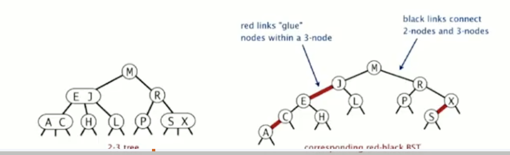

# Balanced Search Trees

When presenting BST, the big issue with them is: The complexity of the operations depend entirely
on the data inserted into the data structure. Assuming randomness of the input, usually we will
have log N complexity, however is not always this case. 

In this section we cover balanced search trees and some of its implementations: 2-3 search trees,
red black BSTs and B-trees

*Note:*

We have different types of balanced trees:
- 2-3 trees: the one we mentioned above and we won't implement because of it's complexity
- red-black trees: Less strictly balanced, potentially slower lookups but fewer rotations during modifications
- avl trees: Are more strictly balanced, resulting in faster lookups but potentially more rotations during insertion and deletion
- b trees:
- splay trees (more or less): It's a self-balanced tree but it doesn't guaranteed log N in the worst case

## 2-3 trees

- Generalize BST trees by allowing 1, 2 keys per node
- 2 node: one key, two children -> left is less or equal, right is greater
- 3 node: two keys, three childrens -> left than min(key1, key2), between(key1, key2), greater than(max(key1, key2))

*Property Perfect balance tree:* Every path from root to null link has same length

These trees have perfect balance!

*Symmetric order:* Inorder traversal yields keys in ascending order

### Search operation

Nothing new here, as bst but now you have to consider wether you are in a 2-node or 3-node

### Put operation

This is the operation that keeps the tree balanced. The general idea is that we move keys around to fill the tree until 
we have 3-nodes. When we try to insert in a 3-node, we split that node in 2 new 2-nodes as leaf and a new 2-node as parent.
This is the unique operation that changes the height of the tree

### Runtime complexity

c * O(log N) for get, put, delete where c depends on the implementation

### Important

Because the complexity of implementing 2-3 trees is high (having to implement 2 types of nodes and checking
in which case you are for updating accordingly) and this complexity can actually create an overhead 
that might be even worst that normal bst, we usually don't implement 2-3 trees but instead directly
we use red-black trees, b+ trees or avls. 

## Red-Black trees

The version presented in Algorithms by sedgewick is Left-leaning red-black BSTs

General idea:
1. Represent 2-3 tree as a BST
2. Use "internal" left-leaning as "glue" for 3 nodes

Here is a picture of a mapping from our 2-3 bst to a left-leaning red-black BST:

From the image above, we can see that a red-black tree is a bst such that:

1. No node has two red links connected to it
2. Every path from root to null link has the same number of black links *This is the property of perfect balance trees* (see in the image above that this property holds true)
3. Red links lean left

### Important

There's a 1 to 1 correspondance from left-leaning red-black trees to 2-3 trees. This means, that if you draw the red links as horizontal links, and
then join those links into a same node, you'll get the 2-3 tree that this black tree is representing. Take a look at the following image:

The above statement is useful because 2-3 trees, even though they are complicated to program, they're quite simple to understand.
