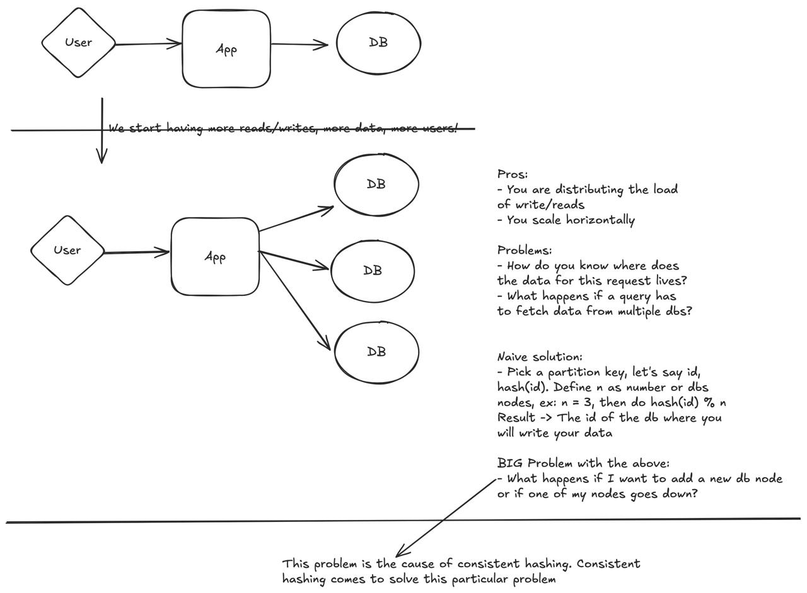

## What is consistent hashing?

Consistent hashing is a technique used in many databases, such as redis, cassandra, memcache, for evenly distributing
data between nodes. 

### The problem

How do we distribute data evenly between multiple nodes? What happens when I add a node? What happens when I delete a node?
These are the problems that consistent hashing will come to solve

## Step by step

For a step by step example on what's going on, see 

### Just having a unique database

## Reference
1. https://www.hellointerview.com/learn/system-design/deep-dives/consistent-hashing
2. https://www.youtube.com/watch?v=zaRkONvyGr8&list=PLMCXHnjXnTnvo6alSjVkgxV-VH6EPyvoX&index=4
